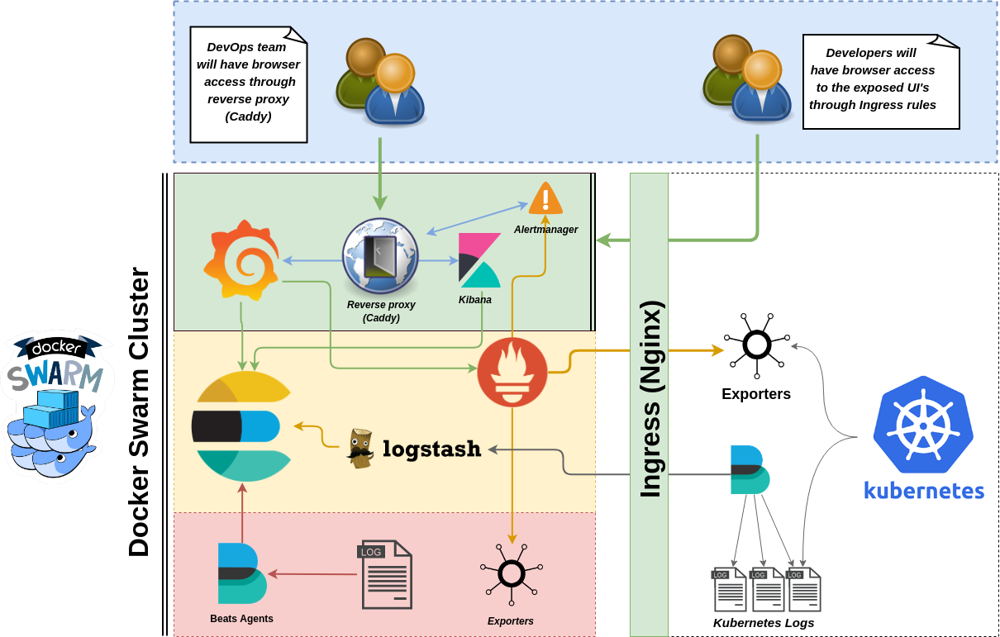

# monitoring-stack

Monitoring stack containing ELK + Grafana + Prometheus (with multiple exporters) and authentication through a reverse proxy (Caddy)

## Overview

This repository is inteended to assist implementing a set of tools for Log Consolidation and monitoring.

This monitoring stack is composed by the following tools:

- [Elastic stack (formerly known as ELK):](https://www.elastic.co/webinars/introduction-elk-stack) Consists of Elasticsearch, Logstash, Kibana and Beats. Although they've all been built to work exceptionally well together, each one is a separate project that is driven by the open-source vendor Elastic -- which itself began as an enterprise search platform vendor.

  - [Elasticsearch:](https://www.elastic.co/products/elasticsearch) is a search engine based on Lucene. It provides a distributed, multitenant-capable full-text search engine with an HTTP web interface and schema-free JSON documents. Elasticsearch is developed in Java and is released as open source under the terms of the Apache License.
  
  - [Logstash:](https://www.elastic.co/products/logstash) Is an open source tool for collecting, parsing, and storing logs for future use. Kibana 3 is a web interface that can be used to search and view the logs that Logstash has indexed. Both of these tools are based on Elasticsearch. Elasticsearch, Logstash, and Kibana, when used together is known as an ELK stack.
  
  - [Kibana:](https://www.elastic.co/products/kibana) Is an open source data visualization plugin for Elasticsearch. It provides visualization capabilities on top of the content indexed on an Elasticsearch cluster. Users can create bar, line and scatter plots, or pie charts and maps on top of large volumes of data.

  - [Beats](https://www.elastic.co/products/beats): Is a lightweight agent from Elastic, which is great for gathering data. They sit on your servers and centralize data in Elasticsearch. Idea is that we use it to increase the the processing muscle, Beats can also ship to Logstash for transformation and parsing.

- [Prometheus](https://github.com/prometheus): Prometheus, a Cloud Native Computing Foundation project, is a systems and service monitoring system. It collects metrics from configured targets at given intervals, evaluates rule expressions, displays the results, and can trigger alerts if some condition is observed to be true.

- [Node_Exporter:](https://github.com/prometheus/node_exporter) Prometheus exporter for hardware and OS metrics exposed by \*NIX kernels, written in Go with pluggable metric collectors.

- [Elasticsearch_Exporter:](https://github.com/justwatchcom/elasticsearch_exporter) Prometheus exporter for various metrics about ElasticSearch, written in Go.

- [CAdvisor:](https://github.com/google/cadvisor) (Container Advisor) provides container users an understanding of the resource usage and performance characteristics of their running containers. It is a running daemon that collects, aggregates, processes, and exports information about running containers. Specifically, for each container it keeps resource isolation parameters, historical resource usage, histograms of complete historical resource usage and network statistics. This data is exported by container and machine-wide.

- [Grafana:](https://github.com/grafana/grafana) is an open source metric analytics & visualization suite. It is most commonly used for visualizing time series data for infrastructure and application analytics but many use it in other domains including industrial sensors, home automation, weather, and process control.

- [Caddy:](https://github.com/stefanprodan/caddy-builder) Caddy is the HTTP/2 web server with automatic HTTPS, including additional plugins to make it act in a similar way as an Ingress/Proxy.

## Requirements

- [Docker](https://docs.docker.com/engine/installation/)
- [Docker Compose](https://docs.docker.com/compose/install/)

## Architecture

The following is a visual representation of how the different tools will be integrated together:



## Deployment steps on Docker Swarm Cluster

**1.** After installing `docker` and `docker-compose`, as described in the requirements session, initialize the swarm, as shown right below:

```shell
docker swarm init
```

A similar output should be displayed if the command was successfull:

```shell
Swarm initialized: current node (a8pml3unconooa7t7qnsw7knp) is now a manager.

To add a worker to this swarm, run the following command:

    docker swarm join --token SWMTKN-1-5jk292hj9b12by0byz4xfnntq07nd58ozrqxxyjx91kx03oqhw-8pl8cm17pj1lam8lq10gmuih0 192.168.122.60:2377

To add a manager to this swarm, run 'docker swarm join-token manager' and follow the instructions.
```

**2.** Clone this repository to the target machine where the monitoring stack will be deployed:

```shell
git clone git@github.com:fsilveir/monitoring-stack.git
```

**3.** From the repository base directory, go into the `docker` directory and execute the following command on your target machine:

```shell
cd monitoring-stack/docker
docker stack deploy monitoring --compose-file docker-compose.yml
```

A similar output should be displayed if the applications were successfully deployed:

```shell
docker stack deploy monitoring --compose-file docker-compose.yml
Creating network monitoring_net
Creating service monitoring_pushgateway
Creating service monitoring_prometheus
Creating service monitoring_kibana
Creating service monitoring_elasticsearch_exporter
Creating service monitoring_caddy
Creating service monitoring_cadvisor
Creating service monitoring_elasticsearch
Creating service monitoring_logstash
Creating service monitoring_nodeexporter
Creating service monitoring_grafana
Creating service monitoring_filebeat
Creating service monitoring_alertmanager
```

You can also confirm if all the required services were successfully started by executing `docker ps`, as shown below:

```shell
$ docker ps
CONTAINER ID        IMAGE                                                 COMMAND                  CREATED              STATUS                    PORTS                NAMES
186f2cb28c7e        prom/alertmanager:v0.19.0                             "/bin/alertmanager -…"   7 seconds ago        Up 4 seconds              9093/tcp             monitoring_alertmanager.1.ktll54qa0ttk9ljr1bpba6f04
cedda4dd3185        docker.elastic.co/beats/filebeat:7.3.2                "/usr/local/bin/dock…"   11 seconds ago       Up 8 seconds                                   monitoring_filebeat.1.apc6mygodsypsdvyb84zfcgpa
3910e960856a        grafana/grafana:6.3.5                                 "/setup.sh"              18 seconds ago       Up 14 seconds             3000/tcp             monitoring_grafana.1.lslqeve2o95djzx24ji3ltqjy
755c577b9f9a        prom/node-exporter:v0.18.1                            "/bin/node_exporter …"   22 seconds ago       Up 18 seconds             9100/tcp             monitoring_nodeexporter.1.tet69f5xrdantjc5omuqfyy6s
5fdb167dcae0        docker.elastic.co/logstash/logstash:7.3.2             "/usr/local/bin/dock…"   26 seconds ago       Up 22 seconds             5044/tcp, 9600/tcp   monitoring_logstash.1.ou571n1now2c9go6o21gkpbt2
945f02693a24        docker.elastic.co/elasticsearch/elasticsearch:7.3.2   "/usr/local/bin/dock…"   33 seconds ago       Up 31 seconds             9200/tcp, 9300/tcp   monitoring_elasticsearch.1.fa1a2dn9wt6027qfzqpfavsn5
8be996662db6        google/cadvisor:v0.33.0                               "/usr/bin/cadvisor -…"   40 seconds ago       Up 38 seconds (healthy)   8080/tcp             monitoring_cadvisor.1.65i1noof89ca1wzcq4dynet11
3d7b098d445d        stefanprodan/caddy:latest                             "/sbin/tini -- caddy…"   46 seconds ago       Up 42 seconds                                  monitoring_caddy.1.yje4slt3myl0w1btlofyf69hg
d05e14053300        justwatch/elasticsearch_exporter:1.1.0                "/bin/elasticsearch_…"   51 seconds ago       Up 49 seconds             9114/tcp             monitoring_elasticsearch_exporter.1.ph0aea6j5dxtmuwg2fy105jh9
ba7a199a8a86        docker.elastic.co/kibana/kibana:7.3.2                 "/usr/local/bin/dumb…"   57 seconds ago       Up 55 seconds             5601/tcp             monitoring_kibana.1.sd0kawrjy12btkrr1yge97m0t
41773e80e777        prom/prometheus:v2.12.0                               "/bin/prometheus --c…"   About a minute ago   Up About a minute         9090/tcp             monitoring_prometheus.1.gpmeg1bgp3dywsmbp23pndil3
d79840c54b78        prom/pushgateway:v0.9.1                               "/bin/pushgateway"       About a minute ago   Up About a minute         9091/tcp             monitoring_pushgateway.1.7rzking41qjisqcglh52qeo04
```

## Accessing the Tools

**Caddy** will work as a reverse proxy and provide basic authentication for accessing the different UI's. The default password is defined during the deployment, default values can be found inside the `docker-compose` fle -- we strongly recommend changing the default passwords before deploying the stack. 

To access the different UI's click at the following URL's:

| Tool         | URL                   |
| ------------ | --------------------- |
| Grafana      | http://localhost:3000 |
| Prometheus   | http://localhost:9090 |
| Alertmanager | http://localhost:9093 |
| Pushgateway  | http://localhost:9091 |
| Kibana       | http://localhost:5601 |

## Testing Data Injection to Logstash

After confirming that the monitoring stack is running, you can inject some log entries for testing purposes. The shipped Logstash configuration allows you to send content via TCP, as shown in the example below:

```shell
$ nc localhost 5000 < /path/to/logfile.log
```

You should be able to confirm through Kibana that the entry you've injected is shown as a new document.

## Common Issues

### Logstash / Filebeat index pattern not displayed in Kibana

By default, the index pattern should be automatically detected the first time you access the Kibana dashboard, however if that does not happen, you can manually create the index patterns with the following `curl` command from within the Kibana container.

#### Manually creating Logstash index pattern on Kibana

```shell
curl -v -XPOST -D- 'http://kibana:5601/api/saved_objects/index-pattern' \
    -H 'Content-Type: application/json' \
    -H 'kbn-version: 7.3.2' \
    -d '{"attributes":{"title":"logstash-*","timeFieldName":"@timestamp"}}'
```

####Manually creating Filebeat index pattern on Kibana

```shell
curl -v -XPOST -D- 'http://kibana:5601/api/saved_objects/index-pattern' \
    -H 'Content-Type: application/json' \
    -H 'kbn-version: 7.3.2' \
    -d '{"attributes":{"title":"filebeat-*","timeFieldName":"@timestamp"}}'
```

**4.** To fully stop the monitoring stack, execute the following command on your target machine:

```shell
docker stack rm monitoring
```

A similar output should be displayed if all the applications was successfully removed:

```shell
Removing service monitoring_alertmanager
Removing service monitoring_caddy
Removing service monitoring_cadvisor
Removing service monitoring_elasticsearch
Removing service monitoring_elasticsearch_exporter
Removing service monitoring_filebeat
Removing service monitoring_grafana
Removing service monitoring_kibana
Removing service monitoring_logstash
Removing service monitoring_nodeexporter
Removing service monitoring_prometheus
Removing service monitoring_pushgateway
Removing network monitoring_net
```

You can confirm if all the required services were successfully removed by executing `docker ps`, a similar output should be displayed:

```shell
docker ps
CONTAINER ID        IMAGE               COMMAND             CREATED             STATUS              PORTS               NAMES
```

## Get support

Create an [issue](https://github.com/fsilveir/docker-monitoring-stack/issues) if you want to report a problem or ask for a new functionality any feedback is highly appreciated!
